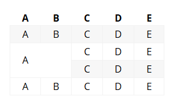

# mdbook-mergecells

Adds cell merging capabilities to mdBook tables.

## Installation

1. Properly install the Go programming language. Use the `go version` command to verify it;
1. Execute the command `go install github.com/DOUBLEU9264/mdbook-mergecells` to compile and install the binary locally;
1. Add the line `[preprocessor.mergecells]` to the `book.toml` file in your mdBook project directory.

## How to Use

Add the annotation `@span:$colspan,$rowspan` to cells that need to be merged right or down. For example:

```markdown
A|B|C|D|E
--|--|--|--|--
A|B|C|D|E
A@span:2,2|B|C|D|E
A|B|C|D|E
A|B|C|D|E
```

This will result in: 

> Note: After merging, only the content of the first cell is preserved.

# mdbook-mergecells

为mdBook提供合并单元格的功能。

## 安装

1. 正确的安装Go编程语言，使用`go version`命令来检查它；
1. 执行命令`go install github.com/DOUBLEU9264/mdbook-mergecells@latest`以编译二进制文件并安装到本地；
1. 在您mdBook项目目录中的`book.toml`文件添加一行`[preprocessor.mergecells]`

## 如何使用

为需要向右或向下合并的单元格添加注解`@span:$colspan,$rowspan`，例如

```markdown
A|B|C|D|E
--|--|--|--|--
A|B|C|D|E
A@span:2,2|B|C|D|E
A|B|C|D|E
A|B|C|D|E
```

结果将会是：

> 注意：合并后只保留第一个单元格中的内容。
